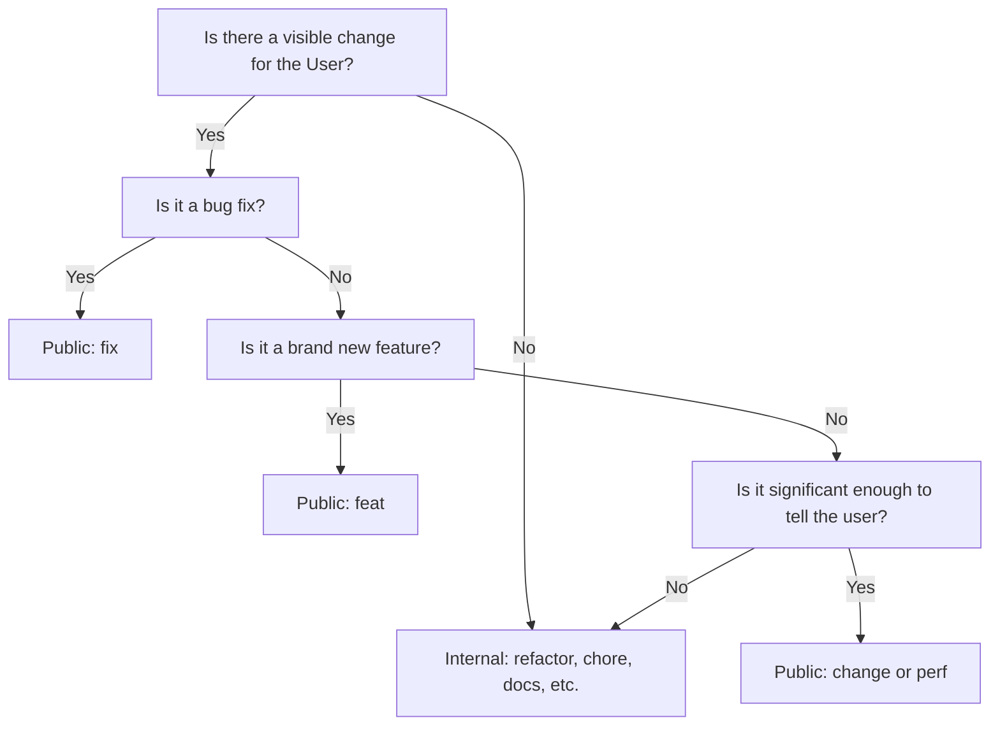

# Commit Message Workflow

## 1. Validation Before Done (MANDATORY)

> [!IMPORTANT]
> **NEVER commit or push code that fails automated checks.**
> Mirror what the CI pipeline runs. If it passes locally, it passes in CI.

Run **every** check below before committing:

```bash
# 1. Full typecheck — mirrors CI exactly (tsc --noEmit for core+server, svelte-check for client)
// turbo
npm run typecheck

# 2. Unit & integration tests (Vitest)
// turbo
npm run test
```

If **any** check fails: **fix it before committing.**

> [!WARNING]
> **CRITICAL:** If you encounter lint errors, you must fix them **THE MOMENT YOU ENCOUNTER THEM**. Do NOT defer lint fixes for later or ask for permission to fix them later. Stop what you are doing and fix the lint errors immediately.

---

## 2. Audience Distinction

| Audience | Prefixes | Purpose |
| :--- | :--- | :--- |
| **User (Public)** | `feat:`, `change:`, `fix:`, `perf:` | User-visible changes. Focuses on **what changed for the user**. |
| **Developer (Private)** | `refactor:`, `chore:`, `docs:`, `test:`, `style:`, `ci:`, `build:` | Hidden from users. Focuses on **how it was done** or maintenance. |

---

## 3. Choosing the Right Prefix

### The "User" Test
Ask yourself: **"Does this change how the user interacts with the app or what they see?"**
- **YES**: Use a User-Facing prefix.
- **NO**: Use an Internal-Only prefix.

### User-Facing Prefixes (Public)
Focus on the **functional impact**, not the technical implementation.

- **`feat:`** (Feature) — Something the user couldn't do before.
    - ✅ `feat: add family member search by birth year range`
    - ❌ `feat: implement SearchService with Fuse.js` (too technical)
- **`change:`** (Change) — Something already exists, but now works differently or better.
    - ✅ `change: improve family tree layout spacing for large families`
    - ❌ `change: update TreeLayout algorithm constants` (too technical)
- **`fix:`** (Bug fix) — Resolves an issue that was visibly broken for the user.
    - ✅ `fix: prevent duplicate family members when importing GEDCOM`
    - ❌ `fix: resolve race condition in GedcomParser` (too technical)
- **`perf:`** (Perf) — Improvements to speed or smoothness that the user will feel.
    - ✅ `perf: speed up tree rendering for 500+ person families`

### Internal-Only Prefixes (Private)
Used for everything else. Keep these technical and concise.
- `refactor:` — Code changes that neither fix a bug nor add a feature.
- `chore:` — Maintenance tasks, dependency updates, configuration.
- `docs:` — Documentation only (README, comments).
- `test:` — Adding missing tests or correcting existing tests.
- `style:` — Non-functional changes (whitespace, formatting, missing semi-colons).

---

## 4. Decision Tree: Should I use a Public Prefix?



---

## 5. Formatting & Tips

1. **Be Functional, Not Technical**: Describe the *result* for the user, not the *code*.
2. **Subject Line Only**: Only the first line of the commit is used for changelogs.
3. **Capitalization**: Keep lowercase for consistency with conventional commits.
4. **Scope is Optional**: `feat(tree): description` works; `(tree):` part is stripped from user-facing lists.

### Bad vs. Good Summary
- **BAD**: `feat: update PersonStore to use Immer patches for history` (User doesn't know what "Immer" or "PersonStore" is)
- **GOOD**: `fix: undo history now persists across page refresh` (User understands the benefit)

---

## 6. Pre-Push Review (MANDATORY)

> [!CAUTION]
> **NEVER push commits to origin without explicit user approval.**

After committing, you **must** present a summary table of **all pending commits** before pushing.

**Step 1 — Discover all pending commits:**

// turbo
```bash
git log origin/main..HEAD --oneline --stat
```

**Step 2 — Present every pending commit in a table:**

| # | Prefix | Commit message | Files changed |
|---|--------|----------------|---------------|
| 1 | fix: | ... | N files |
| 2 | feat: | ... | N files |

Then ask: *"Ready to push, or want to adjust any messages?"*

Only push after the user confirms.

---

## 7. Atomic Commits

Each commit should represent **one logical change**. This keeps the changelog clean and makes reverts safe.

- ✅ One commit per feature, fix, or refactor
- ✅ If a feature requires a prep refactor, commit the refactor separately first (`refactor:` prefix)
- ❌ Don't bundle unrelated changes into a single commit
- ❌ Don't commit half-finished work (use `git stash` instead)

---

## 8. Verify It Actually Works

> [!CAUTION]
> Passing automated checks ≠ working software. Always verify the change functionally.

Before committing, confirm the change works **beyond** lint/tsc/tests:

- **Visual changes**: Open the app and visually confirm the change looks correct
- **Interaction changes**: Test the relevant interaction
- **Bug fixes**: Reproduce the original bug scenario and confirm it's resolved

Ask yourself: *"Would a staff engineer approve this without a demo?"* — if not, verify more.
